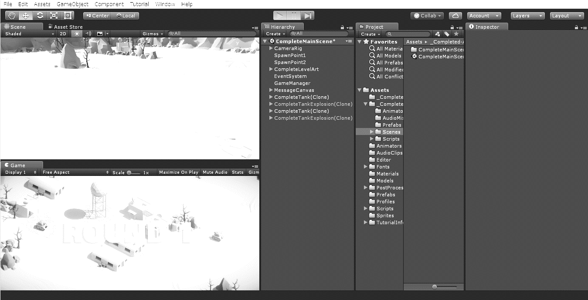

# 2年 情報実習 1
## ～物理演算に触れる～

S2　　 　　　番  
名前：　　　　　　　　　　　　

提出期限  
平成　　　年　　　月　　　日

---
1. 理論
	1. 操作画面の説明
	
		1. Scene（シーン）画面  
			ゲームに登場する物体（GameObject）の配置を変えるための作業画面
		1. Game（ゲーム）画面  
			実際にゲームをプレイするプレイヤーから見える視点を写す画面 シーン内にあるカメラからの視点になる
		1. Hierarchy（ハイアラキー）画面  
			シーン内にあるすべての物体が一覧で表示される画面
		1. Project（プロジェクト）画面  
			ゲームで使うための部品（プログラムや素材）を置いておくための保管場所
		1. Inspector（インスペクター）画面  
			選択した物体の詳細設定を表示するための画面

	1. Unityの基礎
		1. GameObjectとComponentの関係  
			Scene内に配置できる物体を（　GameObject　）と呼ぶ。GameObjectは（　Component　）と呼ばれる構成要素から成る。ほとんどのComponentは後から追加できるが，GameObjectの種類によっては必須で取り外せないものがある。  
			（例）Cubeは初期状態ではTransformやMesh Filterなどの4つのComponentから構成されている。（　Transform　）は物体の位置・回転・大きさを指定する構成要素であり，ほとんどのGameObjectにとって必須である。（　Mesh Filter　）は物体の形状を指定するためのComponentである。 また，Directional Lightも同様に（　Transform　）のComponentが必須である。
		1. PerspectiveとIsometric  
			Persp（Perspective）とは(　透視　)図のことで，遠近感を持たせて描画することをいう。対してIso（Isometric）とは（　投影　）図のことで，物の形を光で投影したような遠近感が無い描画を行うことをいう。Isoは物体の位置調整などに使われる。
		1. Rigidbody  
			Unityで（　物理演算　）を自動的に行うためのComponentがRigidbodyである。Massは（　質量　）を，Dragは（　抗力　）を，Gravityは（　重力　）を意味する。
		1. Collider  
			Colliderはゲームでいうところの（　当たり判定　）を行うためComponentであり，Colliderを持つ物体同士が重なった場合に衝突（　Collision　）が発生し，それ以上めり込まないように位置調整される。
		
	1. プログラミングの基礎
		1.  スクリプトの基本構造  
			次のプログラムはUnityでC\#スクリプトを新規で作成した状態である。
			```cs:MyScript.cs
			using System.Collections;
			using System.Collections.Generic;
			using UnityEngine;

			public class MyScript : MonoBehaviour {
				// Use this for initialization
				void Start () {

				}

				// Update is called once per frame
				void Update () {

				}
			}
			```
			プログラム中で「//」以降の文は（　コメント　）と呼ばれ，プログラムの実行に影響を及ぼさない説明文である。「//」の他に「/\*」と「\*/」で囲む書き方もある。  1～2行目はC\#の基本的な命令を，3行目はUnity独自の命令を，4行目以降で省略した名前で書くための命令である。  
			5行目の「MyScript」は自分で自由につけて良い名前で，**ファイル名と同じ** でなければならない。また，「MonoBehaviour」はMyScriptがMonoBehaviourの機能を（　継承　）していることを意味し，後述の「Start」や「Update」を使うために必要となる。なお，8行目のStartや13行目のUpdateのように，命令をひとまとめにして名前を付けたものを（　メソッド　）と呼ぶ。  
			8～10行目の「Startメソッド」は，Updateの呼び出しが始まる前に**一度だけ**呼び出されるメソッドである。主に（　初期化　）をする目的で使われる。  
			13～15行目の「Updateメソッド」は，1フレームごとに毎回呼び出される。なお，実行中はコンピュータの負荷によって変わるが1秒間に60フレーム程度が実行されている。1秒間に実行されるフレーム数を（　フレームレート　）と呼び（　FPS　）という単位で表される。物理演算(Rigidbody)に関する命令は，フレームレートが変動すると異常な動作をするため，固定フレームレートで実行される（　FixedUpdate　）メソッドを使用する。

		1. インデントスタイル  
			C言語やそれを基に作られたC++，Java，C\#などの言語は記述の自由度が高いため，どのようなプログラムでも書こうと思えば一行で書くことができる欠点がある。可読性（読みやすさ）を高めるために一定のルールに従うことが強く推奨される。代表的なものにインデントスタイルがある。  
			インデントとは（　字下げ　）のことで，インデントスタイルの中でも最も普及しているK&Rスタイルでは中括弧「{}」の中の記述は空白4つ分（Tabキー 1個分）を字下げするよう決められている。  
			MonoDevelopにはオートフォーマットと呼ばれるインデントを自動的に修正する機能があり，範囲選択した後にキーボードのControl \+ I で行うことができる。

		1. 自動補完（オートコンプリート）  
			Unityでの開発を含め，現代のプログラミングでは使用できる命令の数が膨大であるため，すべてを正確に記憶して使いこなすことはほぼ不可能である。そこで，MonoDevelopを含むIDE（統合開発環境）には，入力を補助する機能が備わっている。  
			MonoDevelopでは記述中に予測が表示され，矢印キーで候補から選択し，TabキーやEnterキーで決定ができる。

		1. デバッグの方法  
			プログラムの実行中に，シーンに現れないような値を確認したい場合，Debug.Logメソッドを使用する。Debug.Logの実行結果はConsole画面に表示される。Console画面は標準では画面上に無いので，画面最下部のステータスバーをクリックするか，Window -\> Consoleで開くことができる。  
			（例1）毎フレーム「Hello」という文字列をConsoleに表示するプログラム  
			```cs
			void Update () {
				Debug.Log("Hello");
			}
			```  
			また，例文中の"Hello"を変数，プロパティ，メソッドやそれらを使った計算式に置き換えることもできる。

		1. プリミティブ型  
			C言語と同様に，int型（整数型）やfloat型（浮動小数点型）を使って変数を宣言することができる。このような基本的な型は（　プリミティブ　）型と呼ばれ，他にdouble，string，boolなどがある。プリミティブ型やメソッドを複雑に組み合わせることで，クラスなどの複合型が作られている。

		1. if文  
			（例2）実行しても何も表示されないが，9行目のnumberに0以外を代入すると「Hello」という文字列をConsoleに表示するプログラム  
			```cs
			public class MyScript : MonoBehaviour {
				int number;
				// Use this for initialization
				void Start () {
					number = 0;
				}
				// Update is called once per frame
				void Update () {
					if (number != 0) {
						Debug.Log("Hello");
					}
				}
			}
			```  
			※C言語と同様に「=」は代入を意味し，条件文で「等しい」を表す時は「（　==　）」を使う。

		1. this  
			スクリプト中で「this」は自分自身（のインスタンス）を表し，スクリプトが張り付けられたGameObject自身を指すと考える。※thisは省略できる。  
			（例3）スクリプトで「this.GetComponent\<Rigidbody\>()」と書くと，スクリプトが張り付けられたGameObjectのコンポーネントのひとつであるRigidbodyを取得する意味になる。

	1. スクリプトの具体例  
		1. 物体の色を変更する  
			（例3）スクリプトが張り付けられたGameObjectの色を青に変える
			```cs
			void Update () {
				this.GetComponent<MeshRenderer>().material.color = Color.blue;
			}
			```

		1. 物体の位置を取得する  
			（例4）x座標をコンソールに表示する
			```cs
			void Update () {
				Debug.Log(this.transform.position.x);
			}
			```

		1. キーボードの入力を取得する  
			（例5）キーボードの「A」を押している間ずっとConsoleに「Hello」と表示する
			```cs
			void Update () {
				if (Input.GetKey(KeyCode.A)) {
					Debug.Log("Hello");
				}
			}
			```  
			※14行目GetKeyをGetKeyDownに変えると押された時に一度だけ反応するようになる。

1. 実験環境  

	|名称/Name|種別/category|会社名/Vendor|ﾊﾞｰｼﾞｮﾝ/Ver.|
	|:--:|:--:|:--:|:--:|
	|macOS|オペレーティングシステム|Apple|10.12(Sierra)|
	|Unity|ゲームエンジン|Unity Technologies|5.6.0|

1. 課題  
	1. 課題1  
		プリミティブオブジェクト(立方体や球などの基本的な図形)とRigidbodyコンポーネントのみを使用して，ドミノ倒しを仮想的に作成せよ。
	1. 課題2  
		FixedUpdateメソッドのデフォルトのFPSを調べ，途中計算を含めて結果を別紙に記述せよ。なお，プログラムが開始してからの経過時間はTime.timeプロパティを使って取り出せる。  
		※Time.timeの値をConsoleに表示するにはDebug.Log(Time.time)と記述する。
	1. 課題3  
		Cubeをposition( , , )の位置に設置し，Rigidbodyコンポーネントを使って自由落下させるシーンを作成する。  
		キーボードのSpaceが押されたときに，物体のy座標をConsole画面に表示するプログラムを作成せよ。ボタンを一回押すごとに一度だけ表示させよ。
	1. 課題4  
  		課題3において，Cubeのy座標が0より小さくなったとき，物体の色を「赤色」に変化させるプログラムを作成せよ。
	1. 課題5  
		Unityのデフォルトの重力加速度の値を計算によって求め，途中計算を含めて別紙に記述せよ。
		ヒント：$\ x = v_{0}t + \frac{1}{2}at^{2}$より，変位y，重力加速度$\text{\ g}$とすると，
		$y = - \frac{1}{2}gt^{2}$となり，これを$g$について解くと経過時間と変位から重力加速度が求まることがわかる。
	1. 課題6  
		課題3において，物体のy座標１mおきに物体の色を「赤→青→緑→赤→...」の順に繰り返し変化させるプログラムを作成せよ。  
		例：初期色は赤，1 m落ちる青に変わり，2 m落ちると緑に変わる。3 m落ちるとまた赤に戻る。

1. 考察  
	コンピュータでドミノ倒しをシミュレートした際に，どのような点で現実世界との違いを感じたか。物理演算と現実の物理現象の違いを踏まえて具体的に述べよ。
---
#### ＜補足資料＞  
* 視点の動かし方  
	Scene画面で（　副ボタン　）をドラッグすると，視点の向きを変えることができる。また，（　ボタン３　）をドラッグすると，視点を平行移動することができる。マウスの中央のボールを使ってズームイン・ズームアウトができる。
	また，シーンギズモを使って，指定した軸からの視点に変えることができる。シーンギズモの中央をクリックするとIsoとPerspの切り替えができる。なお，Unityではy座標が上下方向を表す。

* 物体の作り方  
	基本的な形状の物体（プリミティブオブジェクト）を作るには，Hierarchy画面の空白部分で右クリック -> 3D Object から選択する。

* 物体の動かし方
	物体の位置，角度，大きさを調整したい場合は，画面左上のアイコンを使用する。アイコンは左から順に「視点移動」「位置移動」「回転」「拡大縮小」「形状変更」を表す。位置移動の際は，（　矢印　）をドラッグすることで軸に沿って位置を変えることができる。  
	ドラッグしている間にcommand⌘キーを押すと，キリの良い位置や角度に動かすことができる。  
	また，Inspector画面のTransformコンポーネントの中にあるPosition（　位置　），Rotation（　角度　），Scale（　大きさ　）の数値を直接指定することもできる。

* キーボードショートカット  
	Unityでよく使うショートカットは次の通り。
	> command⌘ + Z　元に戻す（Undo）  
	command⌘ + S　シーンの保存（Save Scenes）

* 物体の親子関係  
	物体同士が親子関係になっている場合，親オブジェクトを移動させたり，回転させた場合，子オブジェクトもそれに従って変化する。Hierarchy画面でドラッグ&ドロップすることで，親子関係の設定や解除を行うことができる。

* ゲームの開始方法
	物理演算を開始するには，ゲームの開始ボタンを押す必要がある。ゲームの開始は画面中央上部のアイコンを使用する。アイコンは左から「開始」，「一時停止」，「コマ送り」を意味しており，開始ボタンを**もう一度押す**と「停止」になる。ゲームが開始状態（Play Mode）の間に行われた変更は停止した時に**すべて元に戻ってしまう**ため注意が必要である。また，開始状態ではシーンの保存ができない。

* 物体の削除の方法  
	物体をシーンから消すには，Hierarchy画面で消したい物体を右クリックし，（　Delete　）を選択する。

* 物体の複製の方法  
	物体の複製を作るには，Hierarchy画面で複製を作りたい物体を右クリックし，（　Duplicate　）を選択する。複製は重なった状態で作られるので，その後移動する必要がある。command⌘ + Dのショートカットが使える。

* 複数の物体を選択する方法  
	Hierarchy画面command⌘キーを押しながら物体をクリックすると，複数の物体を選択できる。Shiftキーを押しながら範囲の物体を一度に選択することもできる。  
	また，Scene画面上でマウスの主ボタンをドラッグすることで範囲内の物体を選択することができる。ただし，範囲の枠内に物体の全体が含まれていないと選択できないことに注意すること。

* 物体の色の変え方  
	物体の色を変えるには，Project画面の右半分の空白部分を右クリックし，Create -> Materialを選択する。作成したMaterialに任意の名前をつけ，Inspector画面のAlbedoの右にあるカラーピッカーで色を指定する。その後，色をつけたい物体の上に作ったMaterialをドラッグ&ドロップする。

* コンポーネントの削除の方法  
	不要なコンポーネントはコンポーネントの名前を右クリックし「Remove Component」を選択することで削除できる。

* MonoDevelopでの文字の大きさの変え方  
	キーボードのoptionボタンを押しながら，マウスホイールを動かす。

* オートフォーマットの使い方  
	control + I ※中括弧「 { 」の位置が少し変わるので注意すること。

* 大文字しか打てない時の対処法  
	キーボードの矢印キーの左側にあるcaps lockキーを押して解除する。

* スクリプトの実行方法  
	作成したスクリプトは何かの物体に張り付けられることによって，コンポーネントとして動作する。作成したスクリプトをマウスを使って張り付けたい物体にドラッグ&ドロップで動かす。何のスクリプトが張り付けられているかは，その物体のInspector画面で確認できる。  
	同じスクリプトを２つ以上張り付けることができてしまうので注意すること。不要なスクリプトはRemove Componentで削除する。
